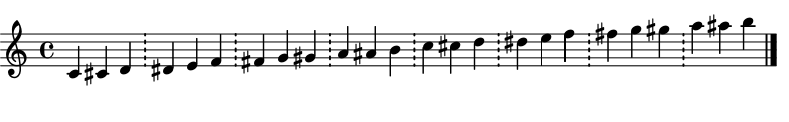
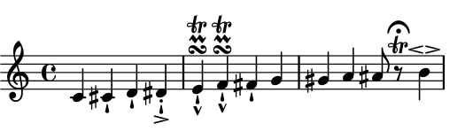

Kodou's interface consists of a class [__Part__](#Part) and a main processing function [__kodou__](#kodou). A configuration file [__.kodou__](#dotkodou) can be used to set some system variables.

- - -

# Part
Signature: ```(events, metadata={})```

A Part object can be thought of as a single instrument.

*  __events__: a dictionary which accepts following keys:
     *  ```"notes"```: a collection (monophon Part) or a collection of collections (polyphon Part) of either MIDI key numbers or Lilypond note names (as strings, including Lilypond rests `"r"` and spacer rests `"s"`, more on [notes](http://lilypond.org/doc/v2.18/Documentation/notation/writing-pitches) and [rests](http://lilypond.org/doc/v2.19/Documentation/notation/writing-rests.en.html)) or a sorted collection (`list` or `tuple`) of them as chords. Please note that MIDI key numbers below or beyond the MIDI range (0, 127) can also be notated (if no _midi_ output needed).
  Microtonal notes smaller than quarter tones are supported according to the specifications of [__Ekmelily__](http://www.ekmelic-music.org/en/extra/ekmelily.htm). Please note that ekmelily is loaded into the _ly_ file by default. It is possible to prevent it from being loaded by setting the `load_ekmelily` key to `no` in the [.kodou](#.kodou) configuration file.
  
     * ```"beats"```: a collection (monophon Part) or a collection of collections (polyphon Part) of integers or floats.

     * ```"durations"```: a dictionary with keys being beats getting the new durations and values being the durations.

* __metadata__: a dictionary which accepts zero (default) or more of the following keys. If Part is polyphon, a specific metadata can be assigned to a single voice by wrapping that metadata's dictionary inside an outer dictionary with _keys_ of type integer representing the voice number (starting from 0) and _values_ being the metadata dictionary. If Part is polyphon and no voice assignment takes place, the metadata dictionary will be applied to all voices likewise.

    *  `"who"` : a string. This should be a unique id and will be used in the _ly_ file as the variable name holding the processed Part instance. If `"who"` is not specified, kodou will generate a random id. 

    *  `"what"`: a dictionary which accepts the following two keys:
          *  `"name"`: value should be a string used as the instrument name.
          *  `"abbr"`: value should be a string used as the abbreviation for the instrument name.

    *  `"staff"`: a dictionary which accepts following key/value pairs:
         *  `"n"`: an integer specifying the number of systems. Defaults to `1`.
         *  `"types"`: a string specifying the type of the staff which can be any of the following names: `"basic", "drum", "rhythmic", "tablature", "mensural", "vaticana", "gregorian"`, or a dictionary (in case the Part instance is polyphonic) with _keys_ being integers specifying the number of each voice (starting from 0) and _values_ being one of the above staff names.
         *  `"bind"`: a string specifying the type of bracket used for grouping the stave together. It can be one of: `"basic", "group", "choir", "grand", "piano"`
  
    *  `"timesig"`: a dictionary which accepts following key/value pairs: 
        *  __key__: can be an integer specifying the beat (started from 0) before which the new time signature should appear, or a two element tuple specifying the time interval to which the time signature should be applied. If _key_ is a tuple, time signature will be set according to the time interval specified by the tuple, i.e. time signature changes will occure at proper points if the time interval divided by the numerator of the time signature yields a rest. Overlapping time signature intervals will be processed, setting the current time signature back to the previous one if the current one lies inside the range of the previous time signature. If _key_ is an integer, the time signature will be valid up to the next _integer_ key. This will overwrite all future time intervals (please note that this also doesn't allow any future time interval specifications for setting time signatures. Consider using tuples as _key_s instead).
        *  __value__: a two element tuple or list representing the numerator and the denominator of the time signature. Defaults to `(4, 4)`. ([__timesig example__ ](#timesig_example))


    *  `"clef"`: a dictionary which accepts following key/value pairs:
        *  __key__: can be an integer or a float specifying the beat where the clef change should take place, or a two element tuple specifying the time interval to which the clef change should be applied. Overlapping time intervals will be processed, setting the current clef back to the previous one if the current one lies inside the range of the previous clef. If the key is not a tuple (i.e. is an integer or a float), the clef will be valid up to the next _integer_ or _float_ key. This will overwrite all future time intervals (please note that this also doesn't allow any future time interval specifications for setting clefs. Consider using tuples as _key_s instead).
        *  __value__: can be one of the following strings: `"C", "F", "G", "G2", "GG", "alto", "altovarC", "baritone", "baritonevarC", "baritonevarF", "bass", "blackmensural-c1", "blackmensural-c2", "blackmensural-c3", "blackmensural-c4", "blackmensural-c5", "french", "hufnagel-do-fa", "hufnagel-do1", "hufnagel-do2", "hufnagel-do3", "hufnagel-fa1", "hufnagel-fa2", "kievan-do", "medicaea-do1", "medicaea-do2", "medicaea-do3", "medicaea-fa1", "medicaea-fa2", "mensural-c1", "mensural-c2", "mensural-c3", "mensural-c4", "mensural-c5", "mensural-f", "mensural-g", "mezzosoprano", "moderntab", "neomensural-c1", "neomensural-c2", "neomensural-c3", "neomensural-c4", "neomensural-c5", "percussion", "petrucci-c1", "petrucci-c2", "petrucci-c3", "petrucci-c4", "petrucci-c5", "petrucci-f", "petrucci-f2", "petrucci-f3", "petrucci-f4", "petrucci-f5", "petrucci-g", "petrucci-g1", "petrucci-g2", "soprano", "subbass", "tab", "tenor", "tenorG", "tenorvarC", "treble", "varC", "varbaritone", "varpercussion", "vaticana-do1", "vaticana-do2", "vaticana-do3", "vaticana-fa1", "vaticana-fa2", "violin"`. Transposing clefs can be written in the form `"clef+N"`, `"clef+[N]"` or `"clef+(N)"` for a _clef_ transpoing _N_ diatonic steps upwards, or `"clef-N"`, `"clef-[N]"` or `"clef-(N)"` for a _clef_ transpoing _N_ diatonic steps downwards. Defaults to `"treble"`. ([clef example](#clef_example))


    *  `"notehead"`: a dictionary which accepts following key/value pairs:
        *  __key__: can be an integer or a float specifying the beat where the notehead should appear, or a two element tuple specifying the time interval to which the notehead should be applied. Notes should exist on specified beats, or else the notehead will be applied to the nearest existing note. Overlapping time intervals will be processed, setting the current notehead back to the previous one if the current one lies inside the range of the previous notehead. If the key is not a tuple (i.e. an integer or a float), the notehead will be valid up to the next _integer_ or _float_ key.  This will overwrite all future noteheads specified in a time interval (please note that this also doesn't allow any future time interval specifications for setting noteheads. Consider using tuples as _key_s instead).
        *  __value__: can be one of the following strings: `"default", "altdefault", "baroque",`
       `"neomensural", "mensural", "petrucci", "harmonic", "harmonic-black", "harmonic-mixed",`
       `"diamond", "cross", "xcircle", "triangle", "slash",`
       `"do", "re", "mi", "fa", "#f", "la", "ti"`. Defaults to `"default"`. ([notehead example](#notehead_example))


    *  `"barline"`: a dictionary which accepts following key/value pairs:
        *  __key__: can be an integer or a float specifying the beat where the barline should appear.
        *  __value__: a string which can be one of the Lilypond barlines or a new barline definition with the following syntax: `"bartype => end begin span"` where each of `end, begin` or `span` can be one of barline elements supported by Lilypond or an underscore `_` as a placeholder for an invisible barline element. Once a new barline has been defined, it can be used subsequently just as built-in barlines. (for more information about Lilypond barlines and new barline definitions please consult the [barline documentation page](http://lilypond.org/doc/v2.18/Documentation/notation/bars)). ([__barline examples__](#barline_example))


    *  `"dynamic"`: a dictionary which accepts following key/value pairs:
        *  __key__: can be an integer or a float specifying the beat where the _absolute_ dynamic should appear, or a two element tuple specifying the time interval to which the _relative_ dynamic (crescendo or decrescendo) should be applied. Overlapping or crossing dynamics will be processed accordingly. If no notes exist on specified beats, rests are created to accommodate the dynamics.
        *  __value__: a string which can be any of the [Lilypond dynamics](http://lilypond.org/doc/v2.19/Documentation/notation/expressive-marks-attached-to-notes#dynamics) or a new _absolute_ dynamic definition with the following syntax: `"dynamic_name => args"`, where `dynamic_name` is the name of the variable used as the new dynamic and `args` are any white-space-seperated combination of ascii characters and the new dynamic (an arbitrary combination of the following characters: `f, m, p, r, s, z`) prefixed by an identifier `D`. Once a new dynamic has been defined, it can be used subsequently just as built-in dynamics. ([__dynamic examples__](#dynamic_example))


    *  `"legato"`: a dictionary which accepts following key/value pairs:
        *  __key__: one of the strings: `"solid"`, `"halfsolid"`, `"dashed"`, `"halfdashed"` or `"dotted"`.
        *  __value__: a list or a tuple of a two element tuple of integers or floats specifying the start and the end beats of the legato (exclusive of the ending beat). If no notes exist on the specified starting beat, a rest is created to accommodate the legato. Please note that Lilypond allows a maximum of two overlapping legatos. From the [documentation page](http://lilypond.org/doc/v2.18/Documentation/notation/expressive-marks-as-curves): _Simultaneous or overlapping slurs are not permitted, but a phrasing slur can overlap a slur. This permits two slurs to be printed at once._ [Also](http://lilypond.org/doc/v2.18/Documentation/notation/expressive-marks-as-curves#phrasing-slurs): _Simultaneous or overlapping phrasing slurs are not permitted_. The legato metadata _values_ will be processed according to these aspects. ([__legato example__](#legato_example))


    *  `"articulation"`: a dictionary which accepts following key/value pairs:
        *  __keys__: can be an integer or a float specifying the beat where the articulation should take place, or a two element tuple specifying the time interval to which the articulation should be applied.
        *  __values__: can be one or more of the following strings:`"accent", "espressivo", "marcato", "portato",`
	`"staccatissimo", "staccato", "tenuto", "prall", "prallup", "pralldown", "upprall",`
	`"downprall", "prallprall", "lineprall", "prallmordent", "mordent", "upmordent",`
	`"downmordent", "trill", "turn", "reverseturn", "shortfermata", "fermata", "longfermata",`
	`"verylongfermata", "upbow", "downbow", "flageolet", "open", "halfopen", "lheel", "rheel",`
	`"ltoe", "rtoe", "snappizzicato", "stopped", "segno", "coda", "varcoda", "accentus",`
	`"circulus", "ictus", "semicirculus", "signumcongruentiae", ">", "^", "_", "!", ".", "-", "+", "<>"`.
	Except with [_fermatas_](http://lilypond.org/doc/v2.18/Documentation/notation/list-of-articulations#fermata-scripts) and [_repeat signs_](http://lilypond.org/doc/v2.18/Documentation/notation/list-of-articulations#repeat-sign-scripts) a note should exist on specified beats or no articulations will be shown. Please note that as soon as rests have been created to show _fermatas_ and _repeat signs_ if specified beats are missing, these new beats may also accept other articulations. ([articulation example](#articulation_example))


- - -
# kodou
Signature: ```(score, metadata={}, file_name="kodou", path="/tmp", dot_kodou="~/.kodou", outputs=["pdf"], view=True)```

The main processing function with following parameters:

  - **score**: can be a Part instance or a list/tuple of Part instances.
  - **metadata**: global metadata which will be applied to all Part instances in the _score_ parameter. Part's _metadata_ will overwrite this parameter.
  - **file_name**: will be used as the name for all output files.
  - **path**: where to save the output files.
  - **dot_kodou**: the path to the [.kodou](#.kodou) file.
  - **outputs**: a collection of output format strings. Can be any of: `"pdf"` (default), `"svg"`, `"jpg"`, `"midi"`, `"mid"`.
  - **view**: whether to show the PDF file using the pdf viewer specified in the [.kodou](#.kodou) file after compilation or not. Defaults to `True`.


- - -
# dotkodou

The content of this configuration file will be used for setting some kodou and system variables. The path to this file defaults to `/home/user/.kodou` and can be reset in the `dot_kodou` parameter of the [kodou](#kodou) function.<br>
The syntax is `key = value`. Lines starting with a pound sign (`#`) are comments.<br>
As of this writing (23. Aug. 2018) following keys can be set:

  -  __ly_version__: Lilypond version. Defaults to `2.21.0`.
  -  __ly_language__: Lilypond language. Defaults to `deutsch`.
  -  __pdf_viewer__: path to the PDF-viewer binary. Defaults to `/usr/bin/zathura`.
  -  __ly_bin__: path to the Lilypond binary. Defaults to `/usr/local/bin/lilypond`.
  -  __ly_paper_size__: paper format used by Lilypond. Defaults to `quarto`. [More formats](http://lilypond.org/doc/v2.19/Documentation/notation/predefined-paper-sizes.en.html)
  -  __ly_staff_size__: staff size used by Lilypond. Defaults to `14`.
  -  __load_ekmelily__: whether the _ekmelily_ system should be loaded for microtonal notation (`yes`) or not (`no`). Defaults to `yes`.


- - -
## Metadata examples

_`from kodou import *` applies to all of the code snippets and will be omitted in the following._


<h4 id="timesig_example">timesig:</h4>

The following metadata:

<pre><code>
kodou(Part(events={"notes": range(60, 84),
                   "beats": range(24)},
           metadata={"timesig": {
               (1, 12): (3, 8),
               (4, 7): [2, 32],
               17: (5, 4),
               (19, 20): (1, 8)
           }}))
</code></pre>

will be processed in the following way:

  1. beat 0 (__4/4__, default time signature) to beat 1 results in a __1/4__
  2. beat 1  (__3/8__) to beat 4 results in a __3/8__
  3. beat 4 (__2/32__) to beat 7 results in one __2/32__ and a remainder of __1/32__
  4. beat 7 resets to __3/8__ till beat 12, resulting in one __3/8__ and a remainder of __2/8__
  5. beat 12 resets to __4/4__ (default time signature) till beat 17, resulting in one __4/4__ and a remainder of __1/4__
  6. from beat 17 on __5/4__


and produce:


- - -

<h4 id="clef_example">clef:</h4>

<pre><code>
kodou(Part(events={"notes": range(60, 84),
                   "beats": range(24)},
           metadata={"clef": {
               (0.5, 8+1/3): "alto",
               (4, 6): "tenor",
               8+2/3: "treble+9",
               13.5: "treble-8",
               16: "soprano"
           }}))
</code></pre>


- - -


<h4 id="notehead_example">notehead:</h4>

The following metadata:

<pre><code>
kodou(Part(events={"notes": range(60, 84),
                   "beats": range(24)},
           metadata={"notehead": {
               (.5, 8+1/3): "mensural",
               (4, 6): "harmonic",
               8+2/3: "cross",
               13.5: "triangle",
               16: "xcircle"
           }}))
</code></pre>


will be processed in the following way:

  1.  nearest existing note to the beat 0.5 is on beat 0 (0.5 will be rounded downwards), from beat 0 to beat 4 are `"mensural"`
  2.  from beat 4 to 6 are `"harmonic"`
  3.  nearest existing note to the beat 8.333333333333334 is on beat 8, from beat 6 to beat 8 are set back to `"mensural"`
  4.  nearest existing note to the beat 8.666666666666666 is on beat 9, beat 8 to beat 9 is set back to `"default"`
  5.  nearest existing note to the beat 13.5 is on beat 13 (again 0.5 will be rounded downwards), from beat 9 to beat 13 are `"cross"`
  6.  from beat 13 to beat 16 are `"triangle"`
  7.  from beat 16 onwards are `"xcircle"`

and produce:


- - -

<h4 id="barline_example">barline:</h4>

<pre><code>
def merge_dicts(d1, *ds):
    """merge two or more dictionaries"""
    for d in ds:
        d1.update(d)
    return d1

kodou(Part(events={"notes": range(60, 84),
                   "beats": range(24)},
           metadata={"barline": merge_dicts(
               # make the default barlines invisible
               {beat: "" for beat in range(3, 24, 4)},
               # set new barlines after each third beat
               {beat: "!" for beat in range(2, 24, 3)},
               # and a closing barline at the end
               {23: "|."}
           )}))
</code></pre>



<pre><code>
kodou(Part({"notes":[range(48, 84)] * 3,
            "beats": [range(36)] * 3},
           {"staff": {"n": 3, "bind": "grand"},
            "barline": {
                # define new barlines and use them
                0: {n * 4 - 1: "= => = _ _" for n in range(1, 10)},
                1: {n * 4 - 1: "] => ] _ _" for n in range(1, 10)},
                2: {n * 4 - 1: "[ => [ _ _" for n in range(1, 10)}
            }}))
</code></pre>


- - -

<h4 id="dynamic_example">dynamic:</h4>

<pre><code>
kodou(Part({"notes": range(60, 72),
            "beats": [n * .5 for n in range(12)]},
           {"dynamic": {(0, 5.5): "<"}}))
</code></pre>


<pre><code>
def merge_dicts(d1, d2):
    """merge two dictionaries"""
    d1.update(d2)
    return d1

kodou(Part(events={"notes": [range(60, 72), range(72, 60, -1)] * 5,
                   "beats": [range(12)] * 10},
           metadata={"staff": {"n": 10, "bind": "grand"},
                     "dynamic": merge_dicts(
                         {v: {3: "p", 7: "sf", (0, 11): ">"}
                          for v in range(0, 10, 2)},
                         {v: {2: "sf", (0, 11): "<"}
                          for v in range(1, 10, 2)})
           }))
</code></pre>


<pre><code>
kodou(Part({"notes": range(60, 72),
            "beats": range(12)},
           {"dynamic": {(0, 11): "<",
                        (4, 8): ">",
                        6: "ppp"}}))
</code></pre>


<pre><code>
def merge_dicts(d1, *ds):
    """merge two or more dictionaries"""
    for d in ds:
        d1.update(d)
    return d1

kodou(Part(events={"notes": range(60, 72),
                   "beats": range(12)},
           metadata={"dynamic": merge_dicts(
               # define some new absolute dynamics
               {0: "starf => * Drfz *"},
               {1: "roundp => ( Dp )"},
               # now they can be accessed just as any other dynamics
               {beat: "starf" for beat in range(2, 12, 2)},
               {beat: "roundp" for beat in range(3, 12, 2)}
           )}))
</code></pre>


<pre><code>
kodou(Part(events={"notes": range(60, 84),
                   "beats": range(24)},
           metadata={"dynamic": {
               (0, 6): "<",
               (2, 5.1): ">",
               5.5: "sf",
               4: "mp",
               (6.5, 23): "dim",
               (10+2/3, 15.5): "cr",
               13+3/7: "p",
               23: "rfz"
           }}))
</code></pre>


- - -

<h4 id="legato_example">legato:</h4>

<pre><code>
kodou(Part(events={"notes": range(60, 84),
                   "beats": range(24)},
           metadata={"legato": {
               "solid": ((1, 15.5),
                         (3+1/3, 5),
                         (5, 7)),
               "halfdashed": [(7, 12.5),
                              (12.5, 17)],
               "dotted": ((8, 9),
                          (16, 23))
           }}))
</code></pre>


- - -


<h4 id="articulation_example">articulation:</h4>


<pre><code>
kodou(Part(events={"notes": range(60, 72),
                   "beats": range(12)},
           metadata={"articulation": {
	        3: (">", "."),
		(1, 7): "staccatissimo",
		(4, 6): ["prall", "^", "trill", "turn"],
		10.5: ("fermata", "trill"),
		11: "<>"
	   }}))
</code></pre>


