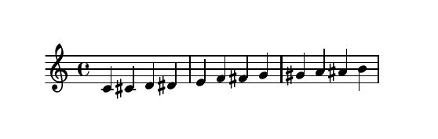
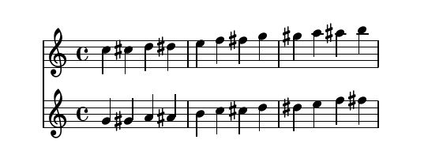
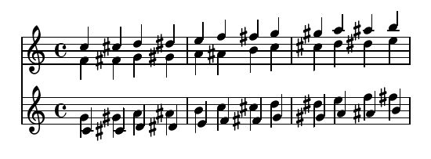

# About

[__Klarenz__](https://en.wikipedia.org/wiki/Clarence_Barlow) is a highly minimalist (the entire API consists of a single class `Part` and a main processor function `proc`!) and Pythonic package for compiling Lilypond sheet music.

# Installation

Klarenz requires Python 3.5 or later:

```
~$ python --version
Python 3.10.12
```

Klarenz requires LilyPond for compiling the final sheet music.
Make sure [Lilypond](http://lilypond.org/download.html) is installed and callable from the commandline:

```
~$ lilypond --version
GNU LilyPond 2.22.2
```


Klarenz is on [Pypi](https://pypi.org/project/klarenz/), so simply use pip to install it:

```
~$ python -m pip install klarenz
~$ python -c "import klarenz; print(klarenz.version)"
1.2.2
```

# First Example

Start Python, import Klarenz and print some notes:

```
from klarenz import *
```
```
proc(Part({"notes": range(60, 72), "beats": range(12)}))
```


If you want to use two instruments instead of just one, simply pass a list of parts to the processor function proc, rather than just one part:
```
proc(
    [
        Part({"notes": range(72, 84), "beats": range(12)}),
        Part({"notes": range(67, 79), "beats": range(12)})
    ]
)
```


To have more than one voice in each part, pack multiple pitch and onset collections in a list:
```
proc(
    [
        Part({"notes": [range(72, 84), range(65, 77)], "beats": [range(12)] * 2}),
        Part({"notes": [range(60, 72), range(67, 79)], "beats": [range(12)] * 2})
    ]
)
```


Simple and pythonic!

- - -
<small>Klarenz is free software: you can redistribute it and/or modify it under the terms of the GNU General Public License as published by the Free Software Foundation, either version 3 of the License, or (at your option) any later version.<br>
This program is distributed in the hope that it will be useful, but WITHOUT ANY WARRANTY; without even the implied warranty of MERCHANTABILITY or FITNESS FOR A PARTICULAR PURPOSE.<br>
See the [GNU General Public License](http://www.gnu.org/licenses/) for more details.</small>

