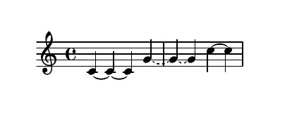

# Metadata Examples

## Tie
```python
proc(
    Part(
        events={
            "pchs": [60, 60, 60, 67, 67, 67, 72, 72],
            "onsets": range(8)
        },
        metadata={
            "tie": {
                "solid": ((0, 2), (6, 7),),
                "dashed": ((3,5),)
            }
        }
    )
)
```

