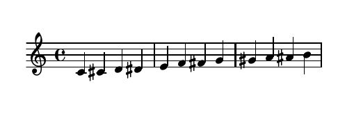
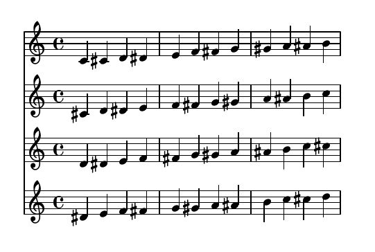

# Function proc
The `proc` function, is the main processing function and has the following signature:

```proc(score, metadata={}, file_name="klarenz", path="/tmp", dot_klarenz="~/.klarenz", outputs=["pdf"], view=True)```


## `score: Part | list | tuple`
can be a signle Part instance or a list/tuple of Part instances.

An example for a solo score (with a single part):
```python
proc(Part(events={"pchs": range(60, 72), "onsets": range(12)}))
```


An example for multiple parts as score argument:
```python
proc(
    [
        Part(events={"pchs": range(60, 72), "onsets": range(12)}),
        Part(events={"pchs": range(61, 73), "onsets": range(12)}),
        Part(events={"pchs": range(62, 74), "onsets": range(12)}),
        Part(events={"pchs": range(63, 75), "onsets": range(12)})
    ]
)
```


  - **metadata**: global metadata which will be applied to all Part instances in the _score_ parameter. Part's _metadata_ will overwrite this parameter.
  - **file_name**: will be used as the name for all output files.
  - **path**: where to save the output files.
  - **dot_klarenz**: the path to the [.klarenz](#.klarenz) file.
  - **outputs**: a collection of output format strings. Can be any of: `"pdf"` (default), `"svg"`, `"jpg"`, `"midi"`, `"mid"`.
  - **view**: whether to show the PDF file using the pdf viewer specified in the [.klarenz](#.klarenz) file after compilation or not. Defaults to `True`.


